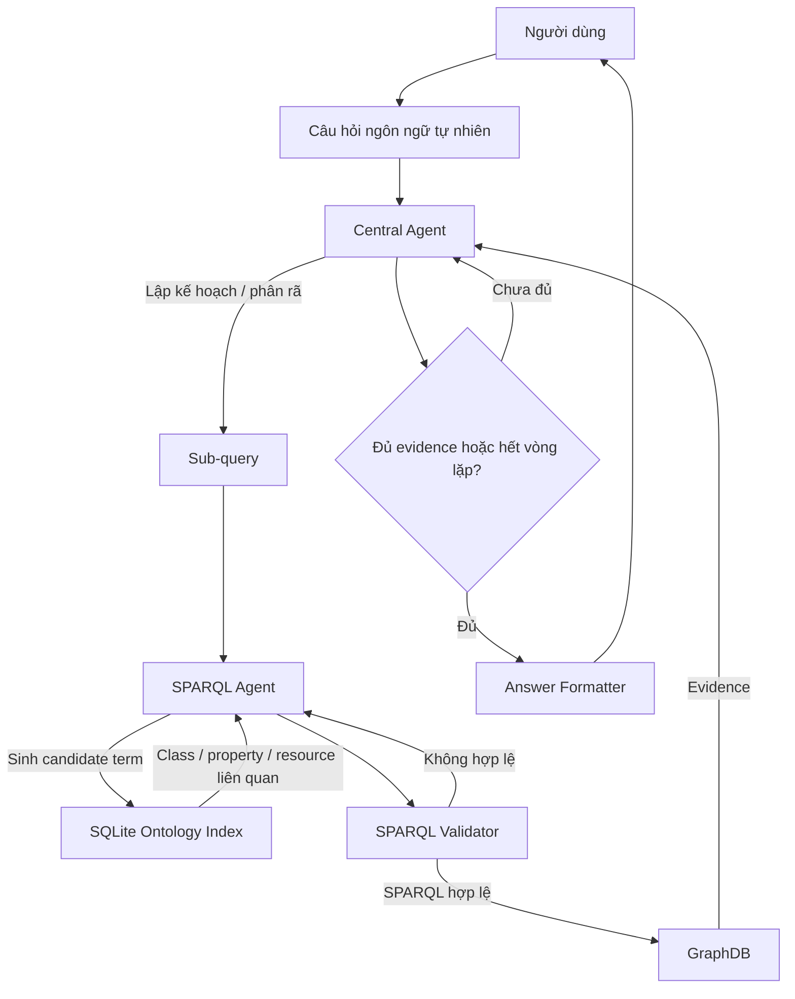

# OntoPilot

OntoPilot là hệ thống hỏi đáp tri thức dựa trên bản thể học và đồ thị tri thức. Hệ thống tiếp nhận câu hỏi ngôn ngữ tự nhiên, lập kế hoạch truy vấn tri thức, sinh và kiểm chứng SPARQL, truy xuất dữ liệu từ GraphDB, sau đó tổng hợp câu trả lời dựa trên evidence thu được.

Đề tài được xây dựng trong khuôn khổ VDT 2026 với định hướng: **Hệ thống hỏi đáp tri thức dựa trên bản thể học sử dụng Agentic Workflow**. Báo cáo cuối nằm tại [Report/FinalReport-OntoPilot.docx](Report/FinalReport-OntoPilot.docx).

## Điểm chính

- Hỏi đáp ngôn ngữ tự nhiên trên ontology và knowledge graph.
- Agentic Workflow gồm Central Agent, SPARQL Agent, validator và Answer Formatter.
- Tìm kiếm schema bằng SQLite ontology index thay vì đưa toàn bộ ontology vào prompt.
- Sinh SPARQL có kiểm chứng cú pháp, tính an toàn và khả năng thực thi trước khi truy vấn GraphDB.
- Câu trả lời cuối được tổng hợp từ execution history và evidence, giảm phụ thuộc vào suy đoán của LLM.
- Có benchmark so sánh với các hướng LLM-only, sinh SPARQL trực tiếp, self-correction và các biến thể không dùng validator.

## Kiến trúc xử lý

OntoPilot không yêu cầu LLM trả lời trực tiếp. Câu hỏi được xử lý qua một workflow có kiểm soát, trong đó các agent phối hợp để phân rã câu hỏi, tìm schema liên quan, sinh truy vấn, kiểm chứng truy vấn và tổng hợp kết quả.



Các thành phần chính:

- **Central Agent** điều phối toàn bộ workflow, quyết định khi nào cần truy vấn đồ thị, phân rã câu hỏi thành các sub-query và đánh giá evidence sau mỗi vòng xử lý.
- **SPARQL Agent** sinh candidate term, tra cứu ontology index, tạo SPARQL và sửa truy vấn khi validator phát hiện lỗi.
- **SQLite Ontology Index** lưu các tài liệu ontology đã chuẩn hóa, hỗ trợ tìm class, property, resource và label liên quan đến candidate term.
- **SPARQL Validator** kiểm tra cú pháp, tính chỉ đọc, tài nguyên liên quan và một số lỗi hình dạng truy vấn trước khi gửi sang GraphDB.
- **GraphDB Service** thực thi SPARQL và trả về evidence dạng gọn để agent tiếp tục xử lý.
- **Answer Formatter** tạo câu trả lời cuối cùng dựa trên evidence và lịch sử thực thi.

## Kết quả benchmark

Benchmark sử dụng 62 câu hỏi thuộc nhiều nhóm như so sánh, multi-hop, entity, boolean, attribute, schema, superlative, list và counting.

| Chiến lược | Accuracy | SPARQL executable | Real evidence | Avg time (s) |
| --- | ---: | ---: | ---: | ---: |
| LLM only (zero-shot) | 0.3419 (21.2/62) | 0.0 | 0.0 | 0.3128 |
| Gen SPARQL (common schema) | 0.4065 (25.2/62) | 3.0 | 3.0 | 6.78 |
| Gen SPARQL (common schema) + self correction | 0.5419 (33.6/62) | 33.2 | 15.0 | 16.93 |
| Schema index search full + Gen SPARQL + self correction | 0.5710 (35.4/62) | 53.4 | 35.3 | 26.74 |
| MAS planning + Gen SPARQL | 0.7774 (48.2/62) | 61.0 | 40.0 | 36.08 |
| **OntoPilot** | **0.8452 (52.4/62)** | **62.0** | **51.8** | **21.08** |

Workbook benchmark nằm tại [Report/Ontology bench - VDT.xlsx](Report/Ontology%20bench%20-%20VDT.xlsx).

## Cấu trúc repository

```text
backend/      Backend API, agent workflow, GraphDB client, ontology lookup
frontend/     Giao diện chat Svelte/Vite
docker/       Docker Compose stack
Ontology/     Ontology và dữ liệu lookup đã chuẩn hóa
bench/        Script benchmark
Report/       Báo cáo cuối và workbook kết quả
docs/         Ghi chú kiến trúc và luồng hệ thống
```

## Chạy bằng Docker Compose

Tạo file cấu hình backend:

```bash
cp backend/.env-example backend/.env
```

Cấu hình tối thiểu các biến cho model provider:

```env
CHAT_API_BASE_URL=https://your-model-provider.example.com
CHAT_API_PATH=/v1/chat/completions
CHAT_API_KEY=your_api_key_here
CHAT_MODEL=your-model-name
CHAT_API_STREAM=true
```

Khởi động toàn bộ stack:

```bash
cd docker
docker compose up --build
```

Các service mặc định:

- Frontend: http://localhost:5200
- Backend health: http://localhost:8090/health
- GraphDB: http://localhost:7200
- Ontology lookup health: http://localhost:8091/health

## Ontology index

Phiên bản hiện tại của OntoPilot dùng SQLite ontology index:

```text
Ontology/normalized/embedding_lookup.sqlite
```

Index được xây dựng từ file JSONL đã chuẩn hóa:

```text
Ontology/normalized/embedding_documents.jsonl
```

Rebuild lookup database:

```bash
cd docker
docker compose exec backend python script/build_embedding_lookup_db.py build --recreate
```

Gọi trực tiếp lookup service:

```bash
curl "http://localhost:8091/lookup?q=scientist&limit=5"
```

## Cấu hình quan trọng

| Biến môi trường | Ý nghĩa |
| --- | --- |
| `CHAT_API_BASE_URL` | Base URL của chat-completions API tương thích OpenAI |
| `CHAT_API_PATH` | Endpoint chat, mặc định `/v1/chat/completions` |
| `CHAT_API_KEY` | API key của model provider |
| `CHAT_MODEL` | Tên model sử dụng |
| `GRAPHDB_URL` | Base URL của GraphDB |
| `GRAPHDB_REPOSITORY` | Repository GraphDB cần truy vấn |
| `SPARQL_AGENT_MAX_ATTEMPTS` | Số lần thử sinh SPARQL cho mỗi sub-query |
| `QUESTION_TIMEOUT_SECONDS` | Timeout tổng cho một câu hỏi |
| `ONTOLOGY_LOOKUP_DB_PATH` | Đường dẫn SQLite ontology index |
| `ONTOLOGY_LOOKUP_DOCUMENTS_PATH` | Đường dẫn JSONL ontology documents |
| `AGENT_LOG_VERBOSE` | Bật log chi tiết cho agent workflow |

Xem đầy đủ tại [backend/.env-example](backend/.env-example).

## API

Endpoint hỏi đáp:

```http
POST /api/chat
Content-Type: application/json

{
  "message": "natural-language question",
  "debug": false
}
```

Endpoint health:

```http
GET /health
```

Khi `debug=true`, response có thể kèm trace nội bộ để kiểm tra quá trình lập kế hoạch, sinh SPARQL, validation và truy vấn GraphDB.

## Ghi chú

- Qdrant và embedding-based indexing còn tồn tại trong repository như phần legacy. Luồng hiện tại của OntoPilot sử dụng SQLite ontology index.
- Ontology index hiện hoạt động tốt nhất khi candidate term do SPARQL Agent sinh ra chứa từ khóa gần với label hoặc identifier trong index.
- Hướng cải thiện tiếp theo là kết hợp lookup hiện tại với embedding-based semantic retrieval để khai thác tương đồng ngữ nghĩa tốt hơn.

## License

Xem [LICENSE](LICENSE).
