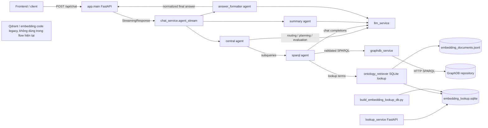
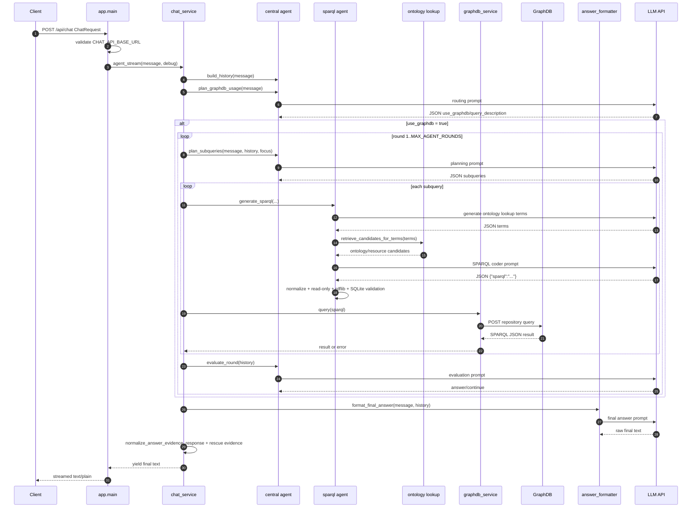
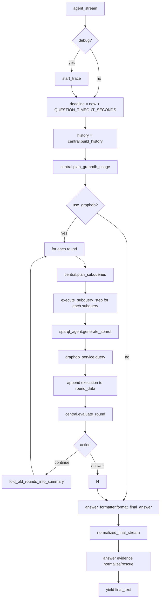
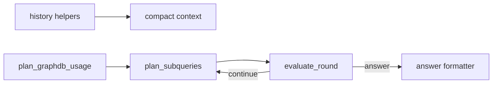
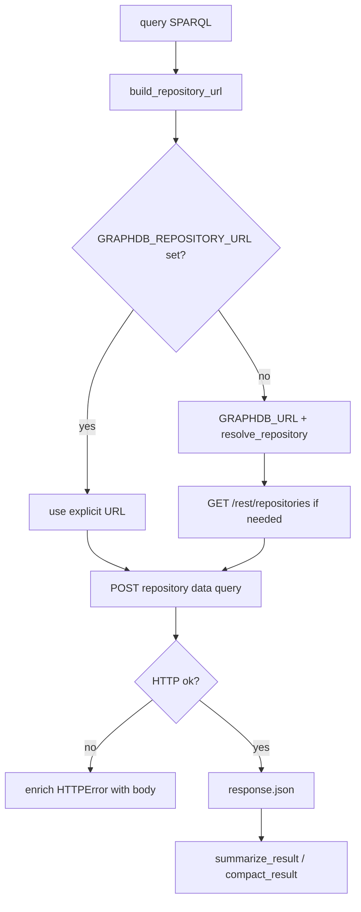
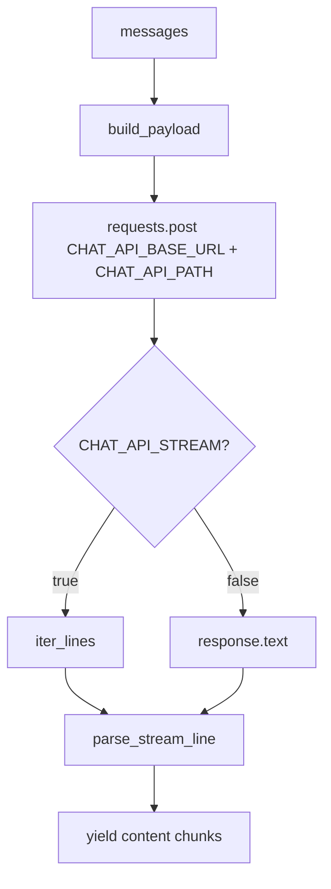
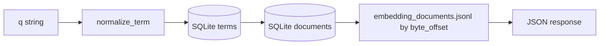
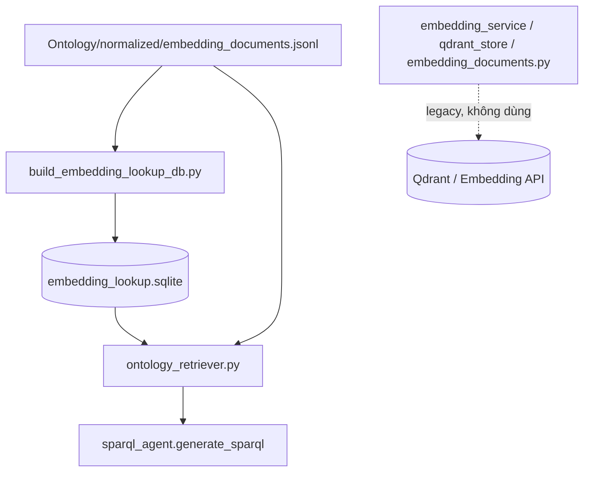

# Backend System Flow

Tài liệu này mô tả cấu trúc hiện tại của `backend/` và flow runtime của chatbot VDT. Backend là một ứng dụng FastAPI, dùng LLM API để điều phối agent, sinh SPARQL, truy vấn GraphDB/DBpedia, rồi format câu trả lời cuối cùng.

## 1. Tổng Quan Kiến Trúc



Các thành phần runtime chính:

| Thành phần | File | Vai trò |
| --- | --- | --- |
| Chat API | `backend/app/main.py` | Khởi tạo FastAPI, CORS, `/health`, `/api/chat`. |
| Schema | `backend/app/schemas.py` | Định nghĩa `ChatRequest`: `message`, `debug`. |
| Pipeline | `backend/app/chat_service.py` | Điều phối toàn bộ request, nhiều round GraphDB, chuẩn hóa câu trả lời cuối. |
| LLM client | `backend/app/llm_service.py` | Tạo OpenAI-compatible chat payload, parse stream/non-stream, retry lỗi tạm thời. |
| GraphDB client | `backend/app/graphdb_service.py` | Resolve repository, POST SPARQL, retry, compact/summarize result. |
| Logging/trace | `backend/app/logging_service.py` | Python logger và per-request debug trace bằng `ContextVar`. |
| Central agent | `backend/app/agents/central/agent.py` | Route GraphDB, lập kế hoạch subquery, đánh giá round, compact history. |
| SPARQL agent | `backend/app/agents/sparql/agent.py` | Sinh SPARQL, dùng ontology lookup, normalize/validate query. |
| Formatter agent | `backend/app/agents/answer_formatter/agent.py` | Tạo câu trả lời cuối, bắt buộc evidence cho câu trắc nghiệm. |
| Summary agent | `backend/app/agents/summary/agent.py` | Tóm tắt round cũ để giảm context. |
| Ontology lookup | `backend/app/rag/ontology_retriever.py` | Tra SQLite + JSONL để lấy class/property/resource hints. |
| Lookup API phụ | `backend/app/lookup_service.py` | API riêng `/lookup` để kiểm tra SQLite lookup DB. |
| SQLite index scripts | `backend/script/build_embedding_lookup_db.py` | Tạo SQLite lookup/index từ `embedding_documents.jsonl`. |
| Qdrant/embedding legacy | `backend/app/rag/embedding_service.py`, `backend/app/rag/qdrant_store.py`, `backend/app/rag/index_ontology.py`, `backend/script/embedding_*.py` | Code cũ còn trong repo, nhưng không còn nằm trong flow đang dùng. |

## 2. Cây Thư Mục Backend

```text
backend/
  Dockerfile
  requirements.txt
  app/
    main.py
    schemas.py
    chat_service.py
    llm_service.py
    graphdb_service.py
    logging_service.py
    lookup_service.py
    agents/
      central/agent.py
      sparql/agent.py
      answer_formatter/agent.py
      summary/agent.py
    rag/
      ontology_retriever.py
      ontology_documents.py
      embedding_service.py
      qdrant_store.py
      index_ontology.py
  script/
    build_embedding_lookup_db.py
    embedding_documents.py
    embedding_perfect.py
    clear_qdrant_collection.py
    isolate_sparql_agent.py
```

## 3. Flow Request `/api/chat`

Endpoint:

```text
POST /api/chat
body: {"message": "...", "debug": false}
response: text/plain StreamingResponse
```

Sequence hiện tại:



### Điểm quan trọng

- `/api/chat` không tự generate token; endpoint stream generator `chat_service.agent_stream`.
- Nếu `CHAT_API_BASE_URL` thiếu, API trả HTTP 500 trước khi vào pipeline.
- `debug=true` bật trace nội bộ; với prompt trắc nghiệm, trace được nhúng vào JSON final trong key `backend_trace`.
- GraphDB chỉ được gọi nếu central routing trả `use_graphdb=true`.
- Mỗi subquery có tối đa `SPARQL_AGENT_MAX_ATTEMPTS`; mỗi SPARQL còn có thêm tối đa 3 lần repair nội bộ trong `sparql_agent.generate_sparql`.
- Cuối cùng luôn đi qua answer formatter, kể cả khi không dùng GraphDB.

## 4. Flow Chi Tiết Trong `chat_service.py`



`execute_subquery_step` là hàm then chốt:

1. Tính timeout còn lại bằng `remaining_seconds(deadline)`.
2. Gọi `graphdb_service.effective_query_timeout_seconds`, trừ đi `QUESTION_FINALIZATION_RESERVE_SECONDS`.
3. Nếu hết thời gian, bỏ qua GraphDB và ghi lỗi timeout.
4. Nếu còn thời gian, lặp qua các attempt:
   - Gọi `sparql_agent.generate_sparql`.
   - Nếu có query, gọi `graphdb_service.query`.
   - Nếu GraphDB timeout/request/json/value error, lưu `graphdb_error`.
   - Ghi attempt vào `sparql_attempts`.
5. Đưa execution vào `round_data["executions"]`.

`fold_old_rounds_into_summary` chỉ chạy khi central quyết định `continue`. Hàm này giữ lại số raw round gần nhất theo `GRAPHDB_RAW_ROUND_WINDOW`; các round cũ hơn được summary agent rút gọn.

## 5. Central Agent

Central agent có 4 nhóm trách nhiệm:



### `plan_graphdb_usage`

Input: original user prompt.

Output JSON mong đợi:

```json
{"use_graphdb": true, "query_description": "...", "reason": "..."}
```

Logic đang có:

- Gọi LLM với vai trò routing agent.
- Nếu prompt trắc nghiệm, đáp án/options không được đưa sang SPARQL coder.
- Dùng GraphDB cho câu hỏi factual về entity, relationship, date, place, class, hoặc multiple-choice cần knowledge.
- Không dùng GraphDB cho greeting, chitchat, writing task, math.
- Nếu parse JSON fail, fallback mặc định `use_graphdb=true`.

### `plan_subqueries`

Input: original prompt, history, round index, current focus.

Output JSON mong đợi:

```json
{
  "subqueries": [
    {
      "id": "q1",
      "description": "...",
      "purpose": "...",
      "expected_evidence": "..."
    }
  ],
  "reason": "..."
}
```

Cơ chế bảo vệ đang có:

- Giới hạn 1..`MAX_SUBQUERIES_PER_ROUND`, hard cap trong code là 4.
- `description` phải là semantic lookup text, không chứa operational words như SPARQL, COUNT, SELECT.
- Count question phải ưu tiên aggregate count.
- Nhắc type constraints: ship, aircraft, city, university, person.
- Nếu LLM trả lời hỏng, `_fallback_subqueries` tạo 1 query trung tính.

### `evaluate_round`

Sau mỗi round:

- Nếu đã đạt `MAX_AGENT_ROUNDS`, bắt buộc `answer`.
- Ngược lại, LLM đánh giá evidence đã đủ chưa.
- Output chỉ có `action=answer|continue`, `reason`, `next_focus`.
- Nếu continue mà thiếu `next_focus`, code tự gán fallback focus.

### History compaction

History raw có dạng:

```json
{
  "original_prompt": "...",
  "steps": [],
  "rounds": [],
  "accumulated_summary": null,
  "summarized_round_count": 0
}
```

Khi đưa vào LLM:

- `compact_execution_for_llm` thay full GraphDB result bằng summary + sample.
- `history_to_text` giới hạn tổng context theo `LLM_HISTORY_MAX_CHARS`.
- `shorten_for_history` giới hạn từng field theo `LLM_HISTORY_FIELD_MAX_CHARS`.

## 6. SPARQL Agent

SPARQL agent là lớp phòng vệ lớn nhất của backend.

```mermaid
flowchart TD
    A[generate_sparql] --> B[generate_ontology_lookup_terms via LLM]
    B --> C[ontology_retriever.retrieve_candidates_for_terms]
    C --> D[possible_resource_block from SQLite]
    D --> E[LLM SPARQL coder prompt]
    E --> F[extract JSON sparql]
    F --> G[normalize escaped whitespace]
    G --> H[add missing prefixes]
    H --> I[expand parenthesized dbr resources]
    I --> J[move leading VALUES into WHERE]
    J --> K[normalize OR to ||]
    K --> L[ensure SELECT LIMIT when needed]
    L --> M{read-only SELECT/ASK?}
    M -->|no| X[return empty]
    M -->|yes| N[validate_sparql]
    N --> O{validation ok?}
    O -->|no, attempt < 3| E
    O -->|yes| P[return SPARQL]
    O -->|no max| Q[return last SPARQL]
```

### Validation layers

`validate_sparql` làm các việc:

- Dùng `prepareQuery(query)` của `rdflib` để bắt syntax error.
- Extract `dbr:` resource trong query.
- Kiểm tra resource có tồn tại trong SQLite `embedding_lookup.sqlite`.
- Nếu subject có type constraint từ context, đọc `embedding_documents.jsonl` để bắt mismatch.
- Bắt pattern nguy hiểm: filter ngôn ngữ của optional label nằm ngoài block OPTIONAL.
- Bắt query leadership quá hẹp với `dbo:rector`/`dbo:head` mà thiếu fallback.

`is_read_only_sparql`:

- Reject `INSERT`, `DELETE`, `LOAD`, `CLEAR`, `CREATE`, `DROP`, `MOVE`, `COPY`, `ADD`, `SERVICE`.
- Sau prefix, query phải bắt đầu bằng `SELECT` hoặc `ASK`.

### Ontology lookup trong SPARQL agent

Có 2 nguồn hints:

1. LLM tạo lookup terms từ user prompt + subquery description + purpose + expected evidence.
2. Regex local tìm candidate resource names trong prompt, rồi tra SQLite để lấy `dbr:*` candidate.

`ontology_retriever.retrieve_candidates_for_terms` trả về class/property/resource candidates, format thành block đưa vào prompt SPARQL coder. Đây là lookup SQLite, không phải vector search runtime.

## 7. GraphDB Service



Timeout logic:

- Base timeout: `GRAPHDB_QUERY_TIMEOUT_SECONDS`.
- Request connect timeout hardcoded 5s.
- `effective_query_timeout_seconds` trừ `QUESTION_FINALIZATION_RESERVE_SECONDS` để chừa thời gian cho final answer.
- Retry chỉ áp dụng cho `requests.ConnectionError`, theo `GRAPHDB_QUERY_MAX_ATTEMPTS`.

Result helpers:

- `summarize_result`: phân biệt ASK vs SELECT, lấy vars, row count, sample 2 rows.
- `has_result`: ASK luôn có result; SELECT cần có binding.
- `compact_result`: lấy sample rows, ưu tiên predicate về place/location/date/birth/death/country/award/founder.

## 8. LLM Service

`llm_service.py` nói chuyện với OpenAI-compatible chat endpoint.



Đang hỗ trợ:

- `Authorization` header hoặc custom header qua `CHAT_API_AUTH_HEADER`/`CHAT_API_AUTH_PREFIX`.
- Browser-like headers: Origin, Referer, User-Agent.
- Extra headers JSON qua `CHAT_API_EXTRA_HEADERS`.
- Retry nếu ConnectionError/Timeout hoặc HTTP status trong `CHAT_API_RETRY_STATUS_CODES`, miễn là chưa yield token nào.
- Parse SSE OpenAI style: `data: {"choices":[{"delta":{"content":"..."}}]}`.

## 9. Answer Formatter Và Normalize Evidence

`answer_formatter.format_final_answer` gọi LLM với history đã compact. Prompt nhấn mạnh:

- Với trắc nghiệm, output phải là JSON:

```json
{"answer":"1","graphDB_evidence":true,"evidence":["..."]}
```

- GraphDB/SPARQL rows trong history là authoritative.
- Không dùng common knowledge để override GraphDB.
- Nếu không có evidence, phải nói fallback.
- Count question phải dùng aggregate count nếu có, không dùng row_count của sample làm tổng.

Sau khi formatter trả raw answer:

1. `normalized_final_stream` lấy latest GraphDB evidence/error.
2. `central.normalize_answer_evidence_response` ép JSON trắc nghiệm có `graphDB_evidence` đúng.
3. `_rescue_graphdb_evidence` sửa trường hợp formatter đã chọn option nhưng để `graphDB_evidence=false` trong khi evaluation/history có evidence match.
4. Nếu `debug=true`, chèn `backend_trace` vào JSON trắc nghiệm.

## 10. Lookup Service Riêng

`backend/app/lookup_service.py` là FastAPI app riêng, không được mount vào `app.main`.

Endpoints:

- `GET /health`: kiểm tra SQLite lookup DB tồn tại.
- `GET /lookup?q=...&limit=5&include_document=true`: normalize query, join `terms` -> `documents`, optionally đọc lại JSONL document bằng `byte_offset`.

Dùng để debug lookup DB:



## 11. SQLite Ontology Index Pipeline

Runtime chat hiện tại dùng SQLite lookup/index trực tiếp. Qdrant và embedding services đã được thay thế khỏi flow đang dùng; các file liên quan vẫn còn trong repo như code legacy.



### `ontology_documents.py`

- Parse N-Triples line by line.
- Gom triple theo subject URI.
- Lưu types, labels, domain, range, subclass.
- `OntologyDocument.kind` suy ra `ObjectProperty`, `DatatypeProperty`, `Class`, `Datatype`, `Property`, `OntologyURI`.
- `payload()` và `text()` tạo representation cho ontology documents. Phần embedding là legacy, nhưng document text/payload vẫn là nguồn dữ liệu cho SQLite lookup file nếu JSONL đã được build trước đó.

### `ontology_retriever.py`

- Sinh/normalize term: bỏ dấu, lower-case, replace `_` bằng space.
- Có heuristic: quoted phrases, capitalized phrases, relation hints, ngrams.
- Tra SQLite `terms` và `documents`.
- Đọc JSONL theo byte offset để lấy full payload.
- Nếu lookup lỗi, log và trả `[]`; lookup là optional, không làm chat fail.

### SQLite lookup/index

- `script/build_embedding_lookup_db.py`: tạo SQLite lookup từ JSONL, table `documents` và `terms`.
- `ontology_retriever.py`: truy vấn SQLite `terms` -> `documents`, rồi đọc lại JSONL bằng `byte_offset`.
- `lookup_service.py`: cung cấp HTTP API phụ để debug SQLite lookup.

### Qdrant/embedding legacy

- `embedding_service.py`: client gọi embedding API OpenAI-compatible, hiện không nằm trong runtime lookup.
- `qdrant_store.py`: client Qdrant, hiện không được chat flow gọi.
- `index_ontology.py`: parse ontology `.nt`, embed text, upsert vào Qdrant; hiện là pipeline cũ.
- `script/embedding_documents.py`: embed JSONL normalized documents vào Qdrant; hiện là pipeline cũ.
- `script/embedding_perfect.py`: embed benchmark perfect URI documents; hiện là pipeline cũ.
- `script/isolate_sparql_agent.py`: test SPARQL agent riêng từ central output.
- `script/clear_qdrant_collection.py`: xóa Qdrant collection; chỉ còn hữu ích nếu cần dọn dữ liệu legacy.

## 12. Biến Môi Trường Quan Trọng

| Nhóm | Biến | Mặc định | Tác dụng |
| --- | --- | --- | --- |
| API | `FRONTEND_ORIGIN` | `http://localhost:5173` | CORS origin thêm vào allow list. |
| LLM | `CHAT_API_BASE_URL` | empty | Bắt buộc cho `/api/chat`. |
| LLM | `CHAT_API_PATH` | `/v1/chat/completions` | Path chat completions. |
| LLM | `CHAT_MODEL` | `default` | Model gửi vào payload. |
| LLM | `CHAT_TEMPERATURE` | `0.2` | Temperature. |
| LLM | `CHAT_API_STREAM` | `true` | SSE streaming hay plain JSON/text. |
| LLM | `CHAT_API_MAX_RETRIES` | `2` | Retry LLM request. |
| Pipeline | `QUESTION_TIMEOUT_SECONDS` | `1200` | Deadline toàn cục cho 1 câu hỏi. |
| Pipeline | `QUESTION_FINALIZATION_RESERVE_SECONDS` | `240` | Thời gian để dành cho final answer. |
| Pipeline | `MAX_AGENT_ROUNDS` | `5` | Số round GraphDB tối đa. |
| Pipeline | `MAX_SUBQUERIES_PER_ROUND` | `4` hard cap | Số subquery mỗi round. |
| Pipeline | `SPARQL_AGENT_MAX_ATTEMPTS` | `3` | Số lần sinh/chạy SPARQL mỗi subquery ở `chat_service`. |
| History | `LLM_HISTORY_MAX_CHARS` | `50000` | Giới hạn context history. |
| History | `LLM_HISTORY_FIELD_MAX_CHARS` | `8000` | Giới hạn từng field. |
| History | `GRAPHDB_RAW_ROUND_WINDOW` | `1` | Số raw round giữ lại trước khi summary. |
| GraphDB | `GRAPHDB_URL` | `http://graphdb:7200` | Base URL GraphDB. |
| GraphDB | `GRAPHDB_REPOSITORY` | auto/`DBPEDIA` | Repository id. |
| GraphDB | `GRAPHDB_REPOSITORY_URL` | empty | Override full repository URL. |
| GraphDB | `GRAPHDB_QUERY_TIMEOUT_SECONDS` | `120` | Timeout read query. |
| GraphDB | `GRAPHDB_QUERY_MAX_ATTEMPTS` | `3` | Retry GraphDB connection error. |
| Ontology lookup | `ONTOLOGY_LOOKUP_ENABLED` | `true` | Bật/tắt SQLite lookup. |
| Ontology lookup | `ONTOLOGY_RAG_ENABLED` | `true` | Legacy gate cho lookup. |
| Ontology lookup | `ONTOLOGY_LOOKUP_DB_PATH` | `/app/Ontology/normalized/embedding_lookup.sqlite` | SQLite DB. |
| Ontology lookup | `ONTOLOGY_LOOKUP_DOCUMENTS_PATH` | `/app/Ontology/normalized/embedding_documents.jsonl` | JSONL source. |
| Ontology lookup | `ONTOLOGY_RAG_TOP_K` | `8` | Số candidate trả về. |
| Legacy embedding | `EMBEDDING_API_BASE_URL` | `http://host.docker.internal:8001` | Chỉ còn dùng bởi pipeline embedding cũ. |
| Legacy embedding | `EMBEDDING_MODEL` | `Qwen/Qwen3-Embedding-4B` | Chỉ còn dùng bởi pipeline embedding cũ. |
| Legacy embedding | `EMBEDDING_OUTPUT_DIMENSIONS` | `1024` | Chỉ còn dùng bởi pipeline embedding cũ. |
| Legacy Qdrant | `QDRANT_URL` | container `http://qdrant:6333`, local `http://localhost:6363` | Chỉ còn dùng bởi code Qdrant cũ. |
| Legacy Qdrant | `QDRANT_COLLECTION` | `ontology_benchmark_perfect` | Chỉ còn dùng bởi code Qdrant cũ. |
| Logging | `LOG_LEVEL` | `INFO` | Python logging level. |
| Logging | `AGENT_LOG_VERBOSE` | `false` | Log trace payload verbose. |

## 13. Những Điểm Cần Chú Ý Khi Đọc Code

- `central.decide_next_action` vẫn tồn tại nhưng flow mới trong `chat_service.agent_stream` đang dùng multi-round `plan_subqueries` + `evaluate_round`, không gọi `decide_next_action`.
- `lookup_service.py` tạo FastAPI app riêng; Docker `CMD` chạy `app.main:app`, nên lookup service cần được chạy riêng nếu muốn dùng HTTP lookup.
- `stream_with_optional_verbose_logging` trong `chat_service.py` hiện không được dùng trong main pipeline.
- Qdrant và embedding services là code legacy; SPARQL agent hiện lấy candidates qua SQLite lookup DB, không gọi Qdrant hay embedding API trong chat runtime.
- `__pycache__` file đang nằm trong repo folder, nhưng không ảnh hưởng flow.
- Text prompt trong `sparql_agent.py` có một số mojibake trong literal Vietnamese rule; logic Python vẫn chạy, nhưng đây là nơi cần cẩn thận nếu sửa prompt.

## 14. Cách Đọc Nhanh Flow Khi Debug

1. Bắt đầu ở `backend/app/main.py::chat`.
2. Đi vào `backend/app/chat_service.py::agent_stream`.
3. Nếu routing dùng GraphDB:
   - `central.plan_graphdb_usage`
   - `central.plan_subqueries`
   - `chat_service.execute_subquery_step`
   - `sparql_agent.generate_sparql`
   - `graphdb_service.query`
   - `central.evaluate_round`
4. Kết thúc:
   - `answer_formatter.format_final_answer`
   - `chat_service.normalized_final_stream`
5. Nếu cần xem vì sao agent quyết định như vậy, gửi request với `debug=true` để lấy `backend_trace` trong output trắc nghiệm, hoặc bật `AGENT_LOG_VERBOSE=true`.
